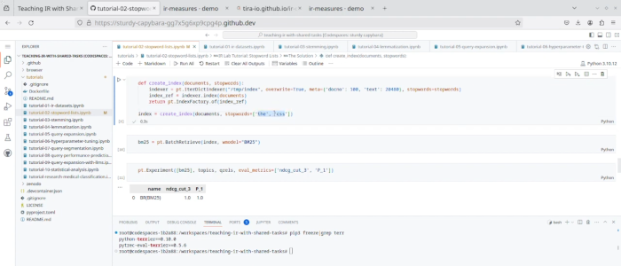

<!-- [](https://doi.org/10.1145/3477495.3531743) -->
<!-- [](https://arxiv.org/abs/2304.00413) -->
[](https://github.com/tira-io/teaching-ir-with-shared-tasks/actions/workflows/ci.yml)
[](https://github.com/tira-io/teaching-ir-with-shared-tasks/issues)
[](https://github.com/tira-io/teaching-ir-with-shared-tasks/pulls)
[](https://github.com/tira-io/teaching-ir-with-shared-tasks/commits)
[](https://github.com/tira-io/teaching-ir-with-shared-tasks/graphs/contributors)
[](LICENSE)

# 🧪 Teaching IR with Shared Tasks

Resources for combining teaching and research in information retrieval coursework.

[](https://github.com/codespaces/new/tira-io/teaching-ir-with-shared-tasks?quickstart=1)

The resources are intended as a collection of supplementary materials for exercises in IR courses that let students experience the full research cycle in their course. We provide:

- A [dashboard](#dashboard) to support brainstorming
  - Explore datasets, approaches, and evaluation techniques
  - Easy to use [online](https://tira-io.github.io/teaching-ir-with-shared-tasks/)
  - Links to in-depth resources
- An [`ir_datasets` browser](#ir_datasets-browser) to explore datasets and runs from TIREx
  - Reuse and explore strong baselines from [TIREx](https://tira.io/tirex)
  - Deep links for referencing in research papers
  - Hosted on GitHub Pages and Zenodo
- A set of [tutorials](#tutorials) covering IR concepts
  - Showcases a single concept using small example data
  - Takes about 15 minutes per tutorial
  - Implemented as Jupyter notebooks in [GitHub Codespaces](https://github.com/codespaces/new/tira-io/teaching-ir-with-shared-tasks?quickstart=1)
- A way to [archive finished courses](#archived-courses)
  - Explore topics, documents, relevance judgments, and submitted runs
  - Leaderboards encourage competition between students
  - Course results are easily re-usable for research

Read more about the resources in our accompanying research paper: \
[Resources for Combining Teaching and Research in Information Retrieval Coursework](#citation) ([abstract](#abstract))

## Contents

- [Installation](#installation)
- [Usage](#usage)
  - [Dashboard](#dashboard)
  - [`ir_datasets` browser](#ir_datasets-browser)
  - [Tutorials](#tutorials)
  - [Archived courses](#archived-courses)
- [Contributing](#contributing)
- [Contact/License/Abstract](#contact)

## Screencast

| [](https://youtu.be/JvbiPoyjZoc) |
|:-:|
| Overview screencast |

Please watch our short screencast [showing our resources on YouTube](https://youtu.be/JvbiPoyjZoc) to get an overview of our teaching resources.

## Installation

The easiest way to start with the tutorials is to open this repository in GitHub Codespaces: \
[](https://github.com/codespaces/new/tira-io/teaching-ir-with-shared-tasks?quickstart=1) \
This will install all the necessary software. Just wait until the editor window has fully loaded (i.e., no progress bars visible; may take a while). \
The other resources (i.e., [dashboard](#dashboard), [`ir_datasets` browser](#ir_datasets-browser), and [archived courses](#archived-courses)) are static web apps that you can run in your web browser.

## Usage

In the following, you will learn how to use each of the four main components of our resources:
the [dashboard](#dashboard), the [`ir_datasets` browser](#ir_datasets-browser), the [tutorials](#tutorials), and the [archived courses](#archived-courses).
The sections roughly follow the order as you would use the components in your course (either as a student or teacher).

### Dashboard

Check out the dashboard web app at: <https://tira-io.github.io/teaching-ir-with-shared-tasks>

| [](https://tira-io.github.io/teaching-ir-with-shared-tasks) |
|:-:|
| Dashboard web app |

Explore existing datasets, retrieval components, and evaluation measures with deep links to implementations and papers.
Components can be filtered to only include, e.g., components with code available or with a corresponding [tutorial](#tutorials).
To focus your search on a specific goal, e.g., precision-oriented components, select a research focus from the dropdown list.

### `ir_datasets` browser

The `ir_datasets` browser can be used to explore existing datasets: <https://tira-io.github.io/ir-dataset-browser>

| [](https://tira-io.github.io/ir-dataset-browser) |
|:-:|
| `ir_datasets` browser web app |

Here are some examples that can be found using the browser:

- [Topic with high nDCG@10 variange](https://tira-io.github.io/ir-dataset-browser/topics?topic=962179&dataset=msmarco-passage/trec-dl-2019/judged)
- [Topic with low nDCG@10 variance](https://tira-io.github.io/ir-dataset-browser/topics?topic=131843&dataset=msmarco-passage/trec-dl-2019/judged)
- [Browsing a document](https://tira-io.github.io/ir-dataset-browser/docs?dataset=msmarco-passage/trec-dl-2019/judged&doc_ids=7501563)

A total of 13 datasets are already available to be explored online. (Some others could not be included due to their licenses.)

### Tutorials

Our hands-on tutorials lower the barrier of entry to implementing IR models and experiments for IR students. You can easily run the tutorials online:

[](https://github.com/codespaces/new/tira-io/teaching-ir-with-shared-tasks?quickstart=1)

A full [list of all covered tutorials](tutorials/README.md#contents) and further information on how to run the tutorials on your local machine can be found in the [tutorial readme](tutorials/README.md).

### Tools for Relevance Judgments (work in progress)

We also include tools that ease uploading pooled documents and downloading relevance judgments to/from the Doccano annotation platform. To use these tools, follow these steps:

1. Install [Python 3.10](https://python.org/downloads/) or later.
2. Create and activate a virtual environment:

    ```shell
    python3.10 -m venv venv/
    source venv/bin/activate
    ```

3. Install dependencies:

    ```shell
    pip install -e .
    ```

4. Create top-k pools of documents retrieved by TIREx baselines: **TODO**

    ```shell
    teaching-ir pool-documents -k 5 [TODO: TIRA parameters] /path/to/topics1.xml [/path/to/topics2.xml ...]
    ```

5. Prepare the relevance judgments in Doccano like so:

    ```shell
    teaching-ir prepare-relevance-judgments project-prefix /path/to/pool1.jsonl /path/to/pool2.jsonl ...
    ```

6. All teams can now work on their relevance judgments.
7. Export the relevance judgments as [qrels](https://trec.nist.gov/data/qrels_eng/) from Doccano like so:

    ```shell
    teaching-ir export-relevance-judgments project-prefix /path/to/pool1.jsonl /path/to/pool2.jsonl ... /path/to/qrels.txt
    ```

8. Once the semester is over and when you have exported all data, clean up the projects and users on Doccano like so:

    ```shell
    teaching-ir clean-up project-prefix
    ```

Please refer to the `teaching-ir` command's help (i.e., run `teaching-ir --help`) for more detailed options.

## Courses

The below list includes finished (✅), ongoing (⏳) and future (🔜) IR courses that use shared task-oriented teaching.
The finished courses have been archived on Zenodo and are accessible via GitHub Pages. To explore their topics and relevance judgments, click on the "browser" links.
[Get in touch](#contact) to integrate your course too!

| 📅 | Semester | Course | University | Browser | Source |
|:-:|:--|:--|:--|:-:|:-:|
| ✅ | Summer semester 2023 | [Information Retrieval](https://temir.org/teaching/information-retrieval-ss23/information-retrieval-ss23.html) | [Leipzig University](https://leipzig.webis.de) | [🔗](https://tira-io.github.io/ir-lab-sose-23/) | [🔗](https://github.com/tira-io/ir-lab-sose-23) |
| ✅ | Summer semester 2023 | [Advanced Information Retrieval](https://friedolin.uni-jena.de/qisserver/rds?state=verpublish&status=init&vmfile=no&moduleCall=webInfo&publishConfFile=webInfo&publishSubDir=veranstaltung&veranstaltung.veranstid=213651&menuid=&topitem=functions&subitem=editlecture&language=en) |  [Friedrich-Schiller-Universität Jena](https://jena.webis.de) | [🔗](https://tira-io.github.io/ir-lab-sose-23/) | [🔗](https://github.com/tira-io/ir-lab-sose-23) |
| ✅ | Winter semester 2023/2024 | [Advanced Information Retrieval](https://temir.org/teaching/information-retrieval-ws23/information-retrieval-ws23.html) | [Leipzig University](https://leipzig.webis.de) | [🔗](https://tira-io.github.io/ir-lab-ws-23/) | [🔗](https://github.com/tira-io/ir-lab-ws-23) |
| ✅ | Winter semester 2023/2024 | [Information Retrieval](https://friedolin.uni-jena.de/qisserver/rds?state=verpublish&status=init&vmfile=no&moduleCall=webInfo&publishConfFile=webInfo&publishSubDir=veranstaltung&veranstaltung.veranstid=216141&noDBAction=y&init=y) | [Friedrich-Schiller-Universität Jena](https://jena.webis.de) | [🔗](https://tira-io.github.io/ir-lab-ws-23/) | [🔗](https://github.com/tira-io/ir-lab-ws-23) |
| ⏳ | Summer semester 2024 | [Search Engines and Neural Information Retrieval](https://digicampus.uni-augsburg.de/dispatch.php/course/details/?sem_id=303dadfd5b91e90a321e1f992fa45bed) |[Augsburg University](https://annefried.github.io/)| [🔗](https://tira-io.github.io/ir-lab-sose-24/) | [🔗](https://github.com/tira-io/ir-lab-sose-24) |
| ⏳ | Summer semester 2024 | [Advanced Information Retrieval](https://friedolin.uni-jena.de/qisserver/rds?state=verpublish&status=init&vmfile=no&publishid=224212&moduleCall=webInfo&publishConfFile=webInfo&publishSubDir=veranstaltung) |[Friedrich-Schiller-Universität Jena](https://jena.webis.de) | [🔗](https://github.com/tira-io/ir-lab-sose-24) | [🔗](https://tira-io.github.io/ir-lab-sose-24/) | [🔗](https://github.com/tira-io/ir-lab-sose-24) |
| ⏳ | Summer semester 2024 | [Information Retrieval](https://ir.web.th-koeln.de/teaching) |[TH Köln](https://ir.web.th-koeln.de/people/philipp-schaer/) | [🔗](https://github.com/tira-io/ir-lab-sose-24) | [🔗](https://tira-io.github.io/ir-lab-sose-24/) | [🔗](https://github.com/tira-io/ir-lab-sose-24) |
| ⏳ | Summer semester 2024 | [Information Retrieval](https://temir.org/teaching/information-retrieval-ss24/information-retrieval-ss24.html) |[Leipzig University](https://temir.org/teaching/information-retrieval-ss24/information-retrieval-ss24.html) | [🔗](https://tira-io.github.io/ir-lab-sose-24/) | [🔗](https://github.com/tira-io/ir-lab-sose-24) |
| 🔜 | _soon_ | _**your** IR course_ | _[get in touch 💬](#contact)_ | 🔜 | 🔜 |

Our accompanying [research paper](#citation) includes a case study and describes our experiences of using our resources in the IR courses of two universities over two semesters.

## Similar resources

We took inspiration from some great tutorials and resources out there. Of course, our resources should not replace but complement them:

- [The PyTerrier Tutorial](https://github.com/terrier-org/ecir2021tutorial)

## Contributing

With the plethora of new retrieval approaches emerging every year, it is hard for us alone to keep all resources up-to-date and to add new tutorials. We would be extremely happy if you (as an IR teacher) could take some time to improve an existing notebook or propose a new one!

Contributing to the resources is as easy as using it: Just [open this repository in GitHub Codespaces](https://github.com/codespaces/new/tira-io/teaching-ir-with-shared-tasks?quickstart=1) (or clone it and open the repo in a [Dev container](https://containers.dev/) with your [favorite IDE](https://containers.dev/supporting)).

## Contact

We would be glad to support you in applying shared task style teaching for your information retrieval course!
Do not hesitate to write us an email or file an [issue](https://github.com/tira-io/teaching-ir-with-shared-tasks/issues/new):

- Maik Fröbe [maik.froebe@uni-jena.de](mailto:maik.froebe@uni-jena.de)
- Harrisen Scells
- Theresa Elstner
- Christopher Akiki
- Lukas Gienapp
- Jan Heinrich Reimer [heinrich.reimer@uni-jena.de](mailto:heinrich.reimer@uni-jena.de)
- Sean MacAvaney
- Benno Stein
- Matthias Hagen
- Martin Potthast

We're happy to help!

## Citation

If you use our resources or its tutorials in your research, please cite the following paper:

> Maik Fröbe, Harrisen Scells, Theresa Elstner, Christopher Akiki, Lukas Gienapp, Jan Heinrich Reimer, Sean MacAvaney, Benno Stein, Matthias Hagen, and Martin Potthast. [Resources for Combining Teaching and Research in Information Retrieval Courses](https://webis.de/publications.html#froebe_2024a). In 47th International ACM SIGIR Conference on Research and Development in Information Retrieval (SIGIR 2024), July 2024. ACM.

You can use the following BibTeX entry for citation:

```bibtex
@InProceedings{froebe:2024a,
  author =                   {Maik Fr{\"o}be and Harrisen Scells and Theresa Elstner and Christopher Akiki and Lukas Gienapp and Jan Heinrich Reimer and Sean MacAvaney and Benno Stein and Matthias Hagen and Martin Potthast},
  booktitle =                {47th International ACM SIGIR Conference on Research and Development in Information Retrieval (SIGIR 2024)},
  month =                    jul,
  numpages =                 11,
  publisher =                {ACM},
  title =                    {{Resources for Combining Teaching and Research in Information Retrieval Courses}},
  year =                     2024
}
```

## License

If you use the resources in your research, we'd be glad if you'd [cite us](#citation).

## Abstract

> A recent study has shown that students in IR courses are especially motivated and learn more effectively when they participate in shared tasks as part of their coursework. We thus present a range of tools and resources that support teachers in integrating research in their IR courses. Based on TIREx and ir_datasets, our Web IDE-based applications and tutorials cover the process of a typical shared task in IR and allow students to gain hands-on experience with experimental IR research—from creating test collections over developing retrieval systems to making relevance judgments and finally statistically analyzing the results. Using our tools, IR research coursework can be conducted on existing or new collections but can also be coupled with an upcoming shared task to which students can optionally submit their final approaches. We do not only present our tools and resources, but also report on our experiences in implementing the corresponding teaching concept in four IR courses for students at two universities. Our results confirm that students are very motivated to conduct research, and we also find that some of the resulting artifacts (e.g., students’ test collections and retrieval approaches) are of genuinely high quality.
